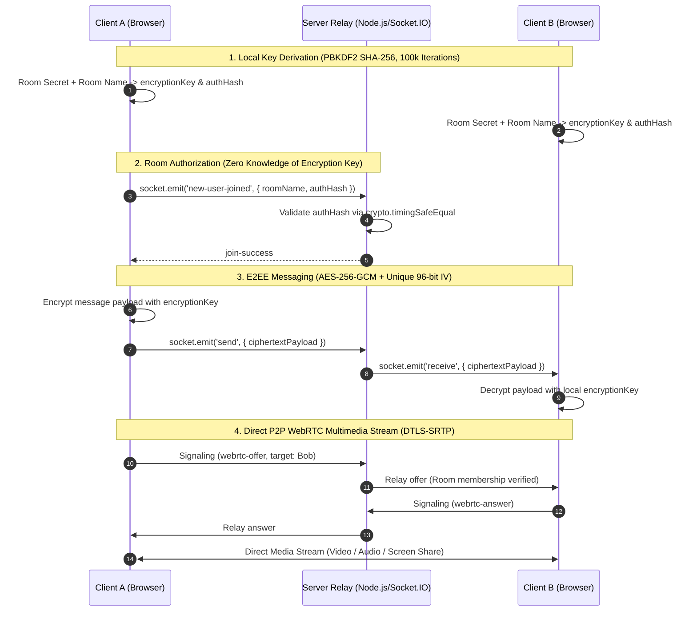

# NijiSamvad (निजी संवाद)

> **Production-Grade, Zero-Database, End-to-End Encrypted (E2EE) Real-Time Messaging & WebRTC Multimedia Platform**

NijiSamvad is a high-performance communication platform engineered for ephemeral, zero-knowledge privacy. Built with React 19, Node.js, Socket.IO, and WebCrypto APIs, it provides end-to-end encrypted messaging, encrypted file attachments, and WebRTC peer-to-peer video calling—without storing user data or chat logs in any persistent database.

---

## 🌟 Key Architectural Highlights

- **🔒 True End-to-End Encryption (E2EE)**: Messages and attachments are encrypted client-side using **AES-256-GCM** via native Web Crypto APIs. The server operates purely as an unprivileged relay with zero access to plaintext or encryption keys.
- **⚡ Zero-Database Ephemeral Teardown**: No database, Redis, or disk persistence. When the last participant leaves a room, all in-memory room state and temporary encrypted attachment files are immediately unlinked and destroyed.
- **📹 WebRTC Peer-to-Peer Multimedia Mesh**: Secured via DTLS-SRTP for high-definition audio/video calls. Features explicit call permissions (`Accept`/`Decline`), selective group calling, active speaker glow, and screen sharing via `RTCRtpSender.replaceTrack()`.
- **🛡️ Cryptographic Safety Numbers**: Displays a 24-character visual safety fingerprint (derived via SHA-256 over room parameters) for out-of-band key verification, eliminating Man-In-The-Middle (MITM) risks.
- **🔥 Hardened Security Engineering**:
  - **Timing-Safe Auth Comparisons**: Enforces `crypto.timingSafeEqual` on room authorization credentials to mitigate timing side-channel attacks.
  - **Unbiased Rejection Sampling**: Room secrets use WebCrypto random sampling with rejection sampling to eliminate modulo bias ($2^{146}$ bits entropy).
  - **Strict CORS & Header Isolation**: Production CORS restricts origin access exclusively to configured production endpoints. Operational metrics endpoints return 404 by default.
  - **XSS & CSP Immunity**: 100% immune to XSS injection through strict React DOM escaping and production Content Security Policy (CSP) headers via Helmet.

---

## 🏗️ System Architecture & Data Flow



---

## 🛠️ Tech Stack & Dependencies

- **Frontend Core**: React 19, Vite, Lucide React Icons.
- **Styling**: Vanilla Modern CSS (Dark Mode Glassmorphism, HSL Design Tokens, Mobile Responsive).
- **Backend Core**: Node.js, Express, Socket.IO.
- **Cryptography**: Web Crypto API (SubtleCrypto), Node.js `crypto` module.
- **Quality & E2E Testing**: Playwright, Oxlint, Custom Security Test Suite.

---

## 🚀 Quick Start & Installation

### Prerequisites
- Node.js 18+ and `npm`

### 1. Clone the Repository
```bash
git clone https://github.com/tanmay9783/NijiSamvad.git
cd NijiSamvad
```

### 2. Install Dependencies
```bash
npm install
```

### 3. Start Local Development (Full-Stack)
```bash
npm run dev:full
```
> Starts the Express/Socket.IO backend on `http://localhost:5000` and the Vite frontend on `http://localhost:5173`.

---

## ⚙️ Environment Configuration

| Variable | Default | Description |
| :--- | :--- | :--- |
| `PORT` | `5000` | HTTP & WebSockets backend port |
| `NODE_ENV` | `development` | Setting to `production` enables strict CORS, CSP, HSTS, and hides `/api/stats` |
| `CLIENT_ORIGIN` | `http://localhost:5173` | Allowed frontend origin for CORS and Socket.IO handshakes |
| `ENABLE_LOAD_METRICS` | `false` | When `true`, exposes `/api/stats` and `/debug/metrics` for load testing |

---

## 🧪 Automated Testing & Verification Suite

NijiSamvad contains a 100% green test suite verifying zero regressions across security, performance, and UI workflows:

```bash
# 1. Run Server Security & Fuzzing Suite (28 Tests)
node tests/test-server.js

# 2. Run Playwright End-to-End Test Suite (13 Tests)
npm run test:e2e

# 3. Run Load & Throughput Stress Test
npm run test:load

# 4. Code Quality & Dependency Audits
npm run lint
npm run build
npm audit --omit=dev
```

### Verified Test Results

| Command | Category | Result |
| :--- | :--- | :--- |
| `node tests/test-server.js` | Server Security, Auth & Fuzzing | **28/28 Passed** |
| `npm run test:e2e` | Playwright E2E User Workflows | **13/13 Passed** |
| `npm run test:load` | Connection & Attachment Load | **50 Users @ 49 msgs/sec, 230+ MB/s Throughput** |
| `npm run lint` | Code Quality (Oxlint) | **PASS (0 Errors)** |
| `npm run build` | Production Vite Bundle | **PASS** |
| `npm audit --omit=dev` | Supply-Chain Audit | **0 Vulnerabilities** |

---

## 🔐 Security Policy & Threat Model

For full details on the cryptographic design, key derivation formulas, server visibility limits, and technical non-goals, refer to **[`SECURITY.md`](SECURITY.md)**.

### Summary of Guarantees
- **Message Confidentiality**: Plaintext is encrypted before leaving browser memory; server operator cannot decrypt payloads.
- **Credential Separation**: `encryptionKey` is never transmitted. Server receives only `authHash`.
- **Ephemeral Guarantees**: Uploaded encrypted file chunks are wiped on last user leave and server reboot.

---

## 👨‍💻 Author

**Tanmay**  
*Software Engineer*  
GitHub: [@tanmay9783](https://github.com/tanmay9783)
